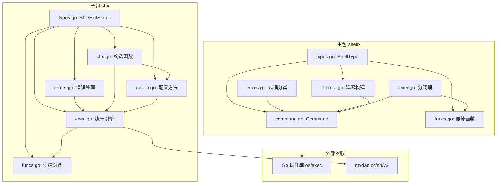

# ShellX 项目深度分析报告

> 分析日期：2026-05-25
> 分析目标：全面理解项目架构、设计模式、代码实现及技术选型

---

## 1. 项目概述

**ShellX** 是一个 Go 语言编写的 Shell 命令执行库，提供双实现路径：
- **主包 (`shellx`)**：基于 Go 标准库 `os/exec`，支持进程控制与异步执行
- **子包 (`shx`)**：基于 `mvdan.cc/sh/v3` 的纯 Go 实现，跨平台一致性更强

### 1.1 元信息

| 属性 | 值 |
|------|-----|
| 模块名 | `gitee.com/MM-Q/shellx` |
| Go 版本 | `go 1.25.0` |
| 核心依赖 | `mvdan.cc/sh/v3 v3.12.0`（仅 shx 子包使用） |
| 间接依赖 | `golang.org/x/sys v0.33.0`, `golang.org/x/term v0.32.0` |

---

## 2. 目录结构解析

```
shellx/                                    # 项目根目录
├── AGENTS.md                              # [新增] 项目分析报告（本文件）
├── APIDOC.md                              # API 文档
├── LICENSE                                # 开源许可证
├── README.md                              # 项目说明文档
├── go.mod                                 # Go 模块定义文件
├── go.sum                                 # 依赖校验文件
│
├── shellx.go                              # 包文档（package comment），含完整用法示例
├── types.go                               # ShellType 枚举定义（跨平台 Shell 类型管理）
├── command.go                             # [核心] Command 结构体 + 配置 + 执行 + 进程控制
├── internal.go                            # [内部] 延迟构建 exec.Cmd + 资源清理 + 辅助函数
├── lexer.go                               # 命令字符串分词器（引号/选择性转义/特殊字符处理）
├── funcs.go                               # 便捷函数 + 命令查找增强 + 工具函数（Exec/ExecOut/FindCmd/FindCommandPath 等 21 个导出函数）
├── errors.go                              # 错误类型定义 + judgeError 错误分类函数
│
├── command_test.go                        # Command 单元测试（含并发安全测试）
├── funcs_test.go                          # 便捷函数 & 分词器单元测试
│
└── shx/                                   # 纯 Go 实现子包
    ├── APIDOC.md                          # 子包 API 文档
    ├── types.go                           # Shx 结构体 + ExitStatus 类型定义 + 包文档
    ├── shx.go                             # 构造函数（New/NewArgs/NewCmds/NewWithParser）
    ├── exec.go                            # 执行方法（Exec/ExecOutput/ExecContext）
    ├── option.go                          # 配置方法（WithDir/WithEnv/WithTimeout/WithContext）
    ├── funcs.go                           # 便捷函数（Run/Out/RunWith/OutCtx 等 10 个导出函数）
    ├── errors.go                          # 错误类型 + handleError 函数 + IsExitStatus
    │
    ├── types_test.go                      # Shx 初始值/链式配置测试
    ├── shx_test.go                        # 构造函数测试
    ├── exec_test.go                       # 执行方法测试（超时/上下文/重复执行）
    ├── option_test.go                     # 配置方法测试（目录/环境变量/超时）
    ├── funcs_test.go                      # 便捷函数测试
    └── errors_test.go                     # 错误处理测试（IsExitStatus/handleError）
```

### 2.1 目录规范度评估

| 维度 | 评价 |
|------|------|
| **命名规范** | 符合 Go 标准（小写文件名 + `_test.go` 测试文件） |
| **文件粒度** | 职责划分清晰（类型/命令/内部/分词/错误/便捷函数各司其职） |
| **文档完备性** | 每个 Go 文件含包级别注释，导出类型/函数均有注释 |
| **测试覆盖** | 双包均有完整测试，含表驱动测试 |
| **冗余情况** | 无冗余目录或文件 |

---

## 3. 核心功能模块

### 3.1 模块总览

```
┌─────────────────────────────────────────────────────────────┐
│                    ShellX 整体架构                            │
├─────────────────────────────────────────────────────────────┤
│                                                             │
│   ┌────────────────────────┐   ┌────────────────────────┐   │
│   │     主包 shellx        │   │   子包 shx              │   │
│   │   (os/exec 实现)       │   │ (mvdan.cc/sh/v3 实现)   │   │
│   │                        │   │                        │   │
│   │  ┌──────────────────┐  │   │  ┌──────────────────┐  │   │
│   │  │  Command 对象     │  │   │  │  Shx 对象         │  │   │
│   │  │  · 配置方法       │  │   │  │  · 配置方法       │  │   │
│   │  │  · 同步/异步执行  │  │   │  │  · 同步执行       │  │   │
│   │  │  · 进程控制       │  │   │  │  · 无进程控制     │  │   │
│   │  └──────────────────┘  │   │  └──────────────────┘  │   │
│   │                        │   │                        │   │
│   │  ┌──────────────────┐  │   │  ┌──────────────────┐  │   │
│   │  │  便捷函数层       │  │   │  │  便捷函数层       │  │   │
│   │  │  Exec/ExecOut/    │  │   │  │  Run/Out/        │  │   │
│   │  │  ExecT/ExecCode   │  │   │  │  RunWith/OutCtx  │  │   │
│   │  └──────────────────┘  │   │  └──────────────────┘  │   │
│   │                        │   │                        │   │
│   │  ┌──────────────────┐  │   │                        │   │
│   │  │  分词器            │  │   │                        │   │
│   │  │  Split/SplitE    │  │   │                        │   │
│   │  └──────────────────┘  │   │                        │   │
│   └────────────────────────┘   └────────────────────────┘   │
│                                                             │
│   ┌──────────────────────────────────────────────────┐      │
│   │              共享设计层                           │      │
│   │  · 链式调用 API · atomic.Bool 单次执行保护       │      │
│   │  · 延迟构建 · 上下文/超时优先级控制               │      │
│   └──────────────────────────────────────────────────┘      │
└─────────────────────────────────────────────────────────────┘
```

### 3.2 模块明细

| 模块名称 | 类型 | 核心功能 | 对应文件 | 输入 | 输出 |
|---------|------|---------|---------|------|------|
| **ShellType 枚举** | 基础支撑 | 定义 8 种 Shell 类型，跨平台自动选择 | [types.go](file:///d:/资源池/下水道/Dev/本地项目/shellx/types.go) | 操作系统类型 | Shell 类型字符串及其执行标志 |
| **Command 对象** | 业务核心 | 命令的配置/构建/执行一体化对象 | [command.go](file:///d:/资源池/下水道/Dev/本地项目/shellx/command.go) | 命令名+参数/字符串 | 错误/输出/进程控制接口 |
| **延迟构建引擎** | 内部支撑 | 执行时才创建 exec.Cmd，支持上下文/超时 | [internal.go](file:///d:/资源池/下水道/Dev/本地项目/shellx/internal.go) | Command 配置 | 就绪的 exec.Cmd 对象 |
| **命令分词器** | 工具支撑 | 智能拆分 Shell 命令字符串（选择性转义，Windows 路径原生兼容） | [lexer.go](file:///d:/资源池/下水道/Dev/本地项目/shellx/lexer.go) | 命令字符串 | 拆分后的参数切片 |
| **错误分类引擎** | 基础支撑 | 统一错误判断与格式化 | [errors.go](file:///d:/资源池/下水道/Dev/本地项目/shellx/errors.go) | 原始错误 + Command | 分类后的用户友好错误 |
| **命令查找引擎** | 工具支撑 | 增强版命令路径查找（ErrDot 处理 + 绝对路径 + 可执行性校验） | [funcs.go](file:///d:/资源池/下水道/Dev/本地项目/shellx/funcs.go) | 命令名称 | 绝对路径/错误/空字符串 |
| **可执行性检测** | 工具支撑 | 跨平台可执行文件判断（Windows 扩展名 + Unix 权限位） | [funcs.go](file:///d:/资源池/下水道/Dev/本地项目/shellx/funcs.go) | 文件路径 | 是否可执行 |
| **便捷函数层** | 业务封装 | 21 个包的导出快捷执行/查找函数 | [funcs.go](file:///d:/资源池/下水道/Dev/本地项目/shellx/funcs.go) | 命令参数/字符串 + 可选超时 | 错误/输出字节流 |
| **Shx 对象** | 业务核心 | 纯 Go Shell 执行对象 | [shx/types.go](file:///d:/资源池/下水道/Dev/本地项目/shellx/shx/types.go) | 命令字符串 | 错误/输出 |
| **Shx 执行引擎** | 业务核心 | mvdan.cc/sh 驱动的命令执行 | [shx/exec.go](file:///d:/资源池/下水道/Dev/本地项目/shellx/shx/exec.go) | Shx 配置 + 上下文 | 错误/合并输出 |
| **Shx 错误处理** | 基础支撑 | ExitStatus 包装与错误分类 | [shx/errors.go](file:///d:/资源池/下水道/Dev/本地项目/shellx/shx/errors.go) | 原始错误 | 分类错误 |

### 3.3 模块依赖关系

```
shellx (主包)
├── types.go          ← 被 command.go, internal.go, funcs.go 依赖
├── errors.go         ← 被 command.go (judgeError) 依赖
├── lexer.go          ← 被 command.go (NewCmdStr → SplitE), funcs.go (Split/SplitE) 依赖
├── command.go        ← 依赖 types.go, errors.go, internal.go (buildExecCmd)
├── internal.go       ← 依赖 command.go (Command 结构体)
└── funcs.go          ← 依赖 command.go (NewCmd/NewCmdStr), types.go, errors.go

shx (子包)
├── types.go          ← 被 shx.go, exec.go, option.go, funcs.go, errors.go 依赖
├── shx.go            ← 依赖 types.go
├── errors.go         ← 依赖 types.go (ExitStatus)
├── exec.go           ← 依赖 types.go, errors.go (handleError)
├── option.go         ← 依赖 types.go
└── funcs.go          ← 依赖 types.go (New), exec.go (Exec/ExecOutput)
```

### 3.4 依赖关系 Mermaid 流程图



### 3.5 依赖风险识别

| 风险类型 | 描述 | 严重度 |
|---------|------|--------|
| **主包零外部依赖** | shellx 主包仅依赖 Go 标准库，无第三方依赖风险 | ✅ 安全 |
| **shx 外部依赖** | 依赖 `mvdan.cc/sh/v3 v3.12.0`，社区活跃，维护良好 | ✅ 安全 |
| **间接依赖** | `golang.org/x/sys` 和 `golang.org/x/term` 由 Go 官方维护 | ✅ 安全 |
| **跨包功能重叠** | 主包与子包提供了相似的 API（如 Exec vs Run），但实现机制不同，为设计意图 | ⚠️ 需文档说明选择依据 |

---

## 4. 设计模式与实现逻辑

### 4.1 识别到的设计模式

| 设计模式 | 代码位置 | 应用场景 |
|---------|---------|---------|
| **Fluent Builder（流式构建器）** | `command.go` 中 `WithWorkDir().WithTimeout().WithEnv()` 等 | 链式配置 Command/Shx 对象 |
| **Lazy Initialization（延迟初始化）** | `internal.go` 中 `buildExecCmd()` | exec.Cmd 在执行时才创建，确保超时计时精确 |
| **Template Method（模板方法）** | `funcs.go` 中 `Exec/ExecStr/ExecOut/ExecOutT` 等 | 18 个便捷函数封装了 Command 的创建→配置→执行流程 |
| **Strategy（策略模式）** | `types.go` 中 ShellType 枚举 + `shellFlags()` | 根据 Shell 类型使用不同执行策略（cmd /c vs sh -c） |
| **Error Wrapping（错误包装）** | `errors.go` 中 `judgeError()` 和 `shx/errors.go` 中 `handleError()` | 将底层错误包装为语义明确的用户友好错误 |
| **Marker Interface（标记接口）** | `shx/types.go` 中 `ExitStatus` 结构体 | 标记并传递退出码错误 |
| **Singleton Protection** | `command.go` 中 `atomic.Bool` 和 `shx/types.go` 中 `executed` | 确保每个命令对象只执行一次 |
| **Functional Options（函数选项变体）** | `command.go` 中配置方法返回 `*Command` 自身 | 链式调用实现，类似 Options 模式 |

### 4.2 核心执行流程

#### 4.2.1 主包执行流程（Exec）

```
用户调用 Exec()
    │
    ▼
NewCmd(name, args...)
    │ 创建 Command 对象，设置默认 shell=ShellDef1
    │ 继承 os.Environ() 环境变量
    ▼
WithStdout(os.Stdout).WithStderr(os.Stderr)
    │ 链式配置输出目标
    ▼
cmd.Exec()  ←─────── 触发执行
    │
    ├─ 1. atomic.CompareAndSwap(false, true)  ──→ 已执行过？→ 返回 ErrAlreadyExecuted
    │
    ├─ 2. buildExecCmd()  ←────────────────── 延迟构建 exec.Cmd
    │      │
    │      ├─ userCtx != nil? → exec.CommandContext(ctx, shell, flags, cmdStr)
    │      ├─ timeout > 0?    → context.WithTimeout → CommandContext
    │      └─ 默认            → exec.Command(shell, flags, cmdStr)
    │
    ├─ 3. execCmd.Run()  ←─────────────────── 阻塞执行
    │      │
    │      └─ 输出重定向到 stdout/stderr
    │
    ├─ 4. defer cleanup()  ←───────────────── 清理 cancel 函数
    │
    └─ 5. judgeError(err, cmd)  ←─────────── 错误分类
           │
           ├─ context.DeadlineExceeded → "timeout" 错误
           ├─ context.Canceled         → "canceled" 错误  
           ├─ exec.ErrDot              → 安全限制错误
           ├─ exec.ErrNotFound         → 命令未找到
           ├─ exec.ExitError           → 退出码错误 (exited with code N)
           └─ 其他                     → 系统错误
```

#### 4.2.2 子包执行流程（shx.Exec）

```
shx.New("echo hello")
    │
    ├─ 创建 Shx 对象
    ├─ parser = syntax.NewParser()   ── mvdan.cc/sh 语法解析器
    ├─ env = expand.ListEnviron()    ── 继承系统环境变量
    └─ dir = os.Getwd()              ── 当前工作目录
    │
    ▼
.WithTimeout(5s).WithEnv("K", "V")
    │ 链式配置
    ▼
cmd.Exec()
    │
    ├─ 1. markExecuted() ── atomic.CAS 防重复执行
    │
    ├─ 2. buildContext()
    │      │
    │      ├─ ctx != nil? → 使用用户上下文（覆盖 timeout）
    │      ├─ timeout > 0 → context.WithTimeout
    │      └─ 默认        → context.Background()
    │
    ├─ 3. execWithContext(ctx)
    │      │
    │      ├─ parser.Parse()     ── 解析命令字符串为 AST
    │      ├─ interp.New(opts)   ── 创建解释器 Runner
    │      │     ├─ interp.Env(s.env)
    │      │     ├─ interp.Dir(s.dir)
    │      │     └─ interp.StdIO(s.stdin, s.stdout, s.stderr)
    │      │
    │      └─ runner.Run(ctx, file)  ── 执行 AST
    │
    └─ 4. handleError(err, cmdStr, timeout)
           │
           ├─ context.Canceled      → "command canceled"
           ├─ context.DeadlineExceeded → "command timed out"
           ├─ interp.ExitStatus     → ExitStatus{Code}
           └─ 其他                  → "command failed"
```

### 4.3 超时与上下文优先级规则

```
                             ┌─────────────────────────────┐
                             │   WithContext(userCtx)      │
                             │   （用户显式设置上下文）       │
                             └─────────────┬───────────────┘
                                           │ 最高优先级
                                           │ 完全覆盖 WithTimeout
                                           ▼
                             ┌─────────────────────────────┐
                             │   WithTimeout(duration)     │
                             │   （设置超时时长）            │
                             └─────────────┬───────────────┘
                                           │ 次优先级
                                           │ userCtx 为 nil 时才生效
                                           ▼
                             ┌─────────────────────────────┐
                             │   默认 context.Background()  │
                             │   （无超时，无取消）           │
                             └─────────────────────────────┘
```

### 4.4 命令字符串分词器实现逻辑

```
splitInternal("git commit -m \"feat: add feature\"")
    │
    ├─ trimSpace → "git commit -m \"feat: add feature\""
    │
    ├─ 逐字符遍历 rune 序列
    │   │
    │   ├─ 遇到 '\\' + nextChar → 选择性转义：
    │   │   仅在 nextChar 为引号/特殊字符/空格/'\' 时作为转义
    │   │   普通字符（如 Windows 路径 \p\f）直接写入反斜杠
    │   ├─ 遇到 '&' & nextChar='&' → 识别多字符操作符 "&&"
    │   ├─ 遇到 '"'/'`' → handleQuoteChar：切换引号状态
    │   │   ├─ 不在引号内 → 进入引号状态，记录引号类型
    │   │   └─ 在引号内且同类型 → 退出引号状态
    │   ├─ 遇到 ';'/'|'/'&' 等 → 非引号态下作为独立 token
    │   └─ 遇到空格 → 仅在非引号态下 flushBuilder 分割
    │
    ├─ 遍历结束 → flush 最后一个 token
    │
    ├─ inQuotes == true → 返回 UnclosedQuoteError
    │
    └─ 返回 ["git", "commit", "-m", "feat: add feature"]
```

---

## 5. 技术栈评估

### 5.1 核心技术栈

| 分类 | 技术 | 版本 | 用途 | 模块 |
|------|------|------|------|------|
| **语言** | Go | 1.25.0 | 项目基础语言 | 全部 |
| **核心库** | Go `os/exec` | 标准库 | 系统命令执行 | 主包 |
| **第三方** | `mvdan.cc/sh/v3` | v3.12.0 | 纯 Go Shell 解析/执行 | `shx` 子包 |
| **官方扩展** | `golang.org/x/sys` | v0.33.0 | 系统调用接口 | `shx`（间接） |
| **官方扩展** | `golang.org/x/term` | v0.32.0 | 终端控制 | `shx`（间接） |

### 5.2 技术选型评估

| 维度 | 评价 |
|------|------|
| **场景适配度** | ⭐⭐⭐⭐⭐ 双包设计精准覆盖不同场景：需要进程控制时用主包，需要跨平台一致性时用子包 |
| **技术成熟度** | ⭐⭐⭐⭐⭐ `os/exec` 为 Go 标准库，`mvdan.cc/sh` 是 Go 生态中最成熟的 Shell 解析库 |
| **依赖风险** | ⭐⭐⭐⭐⭐ 主包零外部依赖，子包仅依赖一个成熟的第三方库 |
| **版本兼容性** | ⭐⭐⭐⭐⭐ Go 1.25.0（最新版本），依赖均维护良好 |
| **社区活跃度** | ⭐⭐⭐⭐ `mvdan.cc/sh/v3` 由 Daniel Martí 维护，Star 数量高，持续更新 |
| **过时风险** | ⭐⭐⭐⭐⭐ 无过时组件，均为活跃维护项目 |

### 5.3 Go 1.25.0 版本说明

项目使用 `go 1.25.0`，属于 Go 语言的较新版本。这意味着项目可以利用 Go 最新的语言特性（如改进的类型推断、泛型优化等）。所有使用 Go 1.21+ 引入的标准库特性（如 `log/slog`、`cmp` 包等）均可使用。

---

## 6. 代码规范与质量分析

### 6.1 命名规范

| 规范项 | 评分 | 说明 |
|--------|------|------|
| **包命名** | ✅ | 全小写单名：`shellx`, `shx` |
| **类型命名** | ✅ | 大写导出：`Command`, `Shx`, `ShellType`, `ExitStatus` |
| **函数命名** | ✅ | `NewCmd`, `Exec`, `ExecOut`, `WithTimeout` 等符合 Go 惯例 |
| **常量命名** | ✅ | 驼峰导出常量：`ShellBash`, `ErrAlreadyExecuted` |
| **文件名** | ✅ | 小写+下划线：`command.go`, `funcs_test.go` |
| **接收器名** | ✅ | 单字母/简短：`c *Command`, `s *Shx` |

### 6.2 注释规范

- **包级别注释**：每个 Go 文件均包含包注释，说明文件职责
- **导出类型注释**：所有导出类型均有注释
- **导出函数注释**：所有导出函数均标注参数/返回值/注意事项
- **代码段注释**：使用 `// ############` 分隔符划分代码区域（如 `// 构造函数`、`// 配置方法`）
- **注意标注**：关键并发安全问题使用 `// 注意:` 或 `// 并发安全说明:` 标注

### 6.3 测试覆盖

| 测试文件 | 测试内容 |
|---------|---------|
| `command_test.go` | Command 创建、配置、执行、超时、上下文、并发安全、进程控制 |
| `funcs_test.go` | Split/SplitE 分词器测试（含引号/转义/特殊字符/Windows 路径等丰富用例），模糊测试 FuzzSplit |
| `shx/shx_test.go` | 构造函数、重复执行检测、getter 方法 |
| `shx/exec_test.go` | Exec/ExecOutput/ExecContext 超时/取消测试 |
| `shx/option_test.go` | WithDir/WithEnv/WithEnvs/WithTimeout 等配置方法 |
| `shx/funcs_test.go` | Run/Out/RunWith/OutWith 等便捷函数 |
| `shx/types_test.go` | ExitStatus 初始值、链式配置 |
| `shx/errors_test.go` | IsExitStatus 识别、handleError 分类 |

### 6.4 异常处理分析

| 场景 | 处理方式 | 评价 |
|------|---------|------|
| **参数校验失败** | `panic()` | 快速失败，符合库设计意图（无效配置不应进入执行阶段） |
| **命令执行错误** | `judgeError()` / `handleError()` | 统一分类包装，返回语义明确的错误 |
| **重复执行** | `atomic.CompareAndSwap` + `ErrAlreadyExecuted` | 优雅的错误返回而非 panic |
| **超时/取消** | context 机制 + 语义错误 | 精确识别 DeadlineExceeded/Canceled |
| **退出码** | `extractExitCode()` / `ExitStatus` | 退出码可从错误中提取，不丢失信息 |
| **ErrDot 安全限制** | `FindCmd` 内部识别并处理 `exec.ErrDot` + `isExecutable` 校验 | 绕过 Go 1.19+ 当前目录执行安全限制 |
| **配置后执行** | 执行前 panic（如 `WithDir` 已检查） | ❗ panic 在库代码中可能不够友好，但属于设计选择 |

### 6.5 扩展性评估

| 维度 | 评价 |
|------|------|
| **新增 Shell 类型** | ⭐⭐⭐⭐⭐ 只需在 ShellType 枚举中新增常量，实现 String()/shellFlags() 即可 |
| **新增便捷函数** | ⭐⭐⭐⭐⭐ 模板方法模式，只需封装 Command 创建→配置→执行三步 |
| **新增执行方式** | ⭐⭐⭐⭐ 在 Command 上新增方法即可，但需同步 internal.go 中的 buildExecCmd |
| **自定义解析器** | ⭐⭐⭐⭐⭐ shx 子包已支持 `NewWithParser` 注入自定义解析器 |
| **插件化扩展** | ⭐⭐⭐ 无插件机制，但可通过 Go 接口进一步抽象 |

### 6.6 性能关键点

| 关注点 | 分析 | 建议 |
|--------|------|------|
| **延迟构建 exec.Cmd** | ✅ 执行时才构建，避免无效构建，确保超时计时精确 | 无需优化 |
| **atomic.Bool 单次保护** | ✅ 轻量级并发控制，无锁性能开销小 | 无需优化 |
| **字符串拼接** | ⚠️ `getCmdStr()` 使用 `fmt.Sprintf` 和 `strings.Join`，高频调用可能产生 GC 压力 | 低优先级优化 |
| **环境变量全量复制** | ⚠️ `WithEnv` 每次追加环境变量，多次调用产生多次切片扩容 | 低优先级优化 |
| **shx 子包 AST 解析** | ⚠️ 每次执行需解析字符串为 AST，短命令场景有解析开销 | 设计取舍，不可避免 |

---

## 7. 核心特点总结

### 7.1 项目核心特点

1. **双实现路径设计**：主包 (`os/exec`) + 子包 (`mvdan.cc/sh`) 双轨制，用户按需选择
2. **零外部依赖（主包）**：主包仅依赖 Go 标准库，无第三方引入风险
3. **延迟构建机制**：`buildExecCmd()` 在执行时才创建 `exec.Cmd`，精确控制超时计时起点
4. **智能错误分类**：`judgeError` 精确识别超时/取消/命令未找到/退出码等不同错误场景
5. **选择性转义分词**：`\ ` 仅在特殊字符前作为转义，`C:\path\file` 路径中的反斜杠不受影响
6. **ErrDot 安全处理**：`FindCmd` 识别 Go 1.19+ 的 `exec.ErrDot`，配合 `isExecutable` 跨平台校验
7. **跨平台自适应**：`ShellDef1`/`ShellDef2` 根据 `runtime.GOOS` 自动选择 Windows/Linux 默认 Shell
8. **链式调用 API**：完全流畅的链式 API 设计，与 Go 生态主流趋势一致
9. **单次执行保护**：`atomic.Bool` 确保每个命令对象精准执行一次
10. **完整测试覆盖**：双包均包含全面的表驱动测试、并发安全测试、模糊测试与 Windows 路径测试

### 7.2 待优化点

| 优先级 | 问题 | 说明 |
|--------|------|------|
| **中** | **panic 策略** | 配置阶段使用 panic 而非返回 error，在库设计中可能过于激进，可考虑返回 error 或提供 `MustXxx` 变体 |
| **低** | **环境变量性能** | `WithEnv` 使用 `append` 不断扩容切片，可预分配容量或使用 `map` 去重 |
| **低** | **字符串拼接效率** | `getCmdStr()` 频繁构建命令字符串，可缓存结果 |
| **低** | **shx 重复代码** | shx 子包的 `WithEnv/WithEnvs/WithEnvMap` 存在逻辑重复 |
| **信息** | **Go 版本选择** | 使用 Go 1.25.0，用户环境可能需要更新 Go 版本 |

### 7.3 关键记忆点（用于后续快速回忆）

```
项目: ShellX - Go Shell 命令执行库
模块: gitee.com/MM-Q/shellx
Go版本: 1.25.0

双包结构:
  ├─ shellx (主包): os/exec 实现, 有进程控制/异步
  │  ├─ types.go: ShellType 枚举 (8种)
  │  ├─ command.go: Command 结构体 (核心)
  │  ├─ internal.go: buildExecCmd 延迟构建
  │  ├─ lexer.go: 命令分词器 (选择性转义, Windows路径兼容)
  │  ├─ errors.go: judgeError 错误分类
  │  └─ funcs.go: 21个导出函数 + FindCmd增强版 + FindCommandPath + windowsExts + isExecutable
  └─ shx (子包): mvdan.cc/sh/v3 实现, 纯Go跨平台
     ├─ types.go: Shx 结构体
     ├─ shx.go: 构造函数
     ├─ exec.go: 执行引擎
     ├─ option.go: 配置方法
     ├─ errors.go: handleError + IsExitStatus
     └─ funcs.go: 10个便捷函数

设计模式: 流式构建器 | 延迟初始化 | 模板方法 | 策略模式 | 错误包装
上下文优先级: WithContext > WithTimeout > context.Background
执行保护: atomic.Bool 确保单次执行
并发安全: 配置阶段非并发安全, 执行阶段并发安全
```

---

## 8. 附录

### 8.1 导出 API 速查

#### 主包 (`shellx`) 导出函数

```go
// 构造函数
func NewCmd(name string, args ...string) *Command
func NewCmds(cmdArgs []string) *Command
func NewCmdStr(cmdStr string) *Command

// 便捷执行函数
func Exec(name string, args ...string) error
func ExecStr(cmdStr string) error
func ExecOut(name string, args ...string) ([]byte, error)
func ExecOutStr(cmdStr string) ([]byte, error)
func ExecT(timeout time.Duration, name string, args ...string) error
func ExecStrT(timeout time.Duration, cmdStr string) error
func ExecOutT(timeout time.Duration, name string, args ...string) ([]byte, error)
func ExecOutStrT(timeout time.Duration, cmdStr string) ([]byte, error)
func ExecCode(name string, args ...string) (int, error)
func ExecCodeStr(cmdStr string) (int, error)

// 工具函数
func Split(cmdStr string) []string
func SplitE(cmdStr string) ([]string, error)
func FindCmd(name string) (string, error)       // 增强版（ErrDot + 绝对路径 + 可执行性校验）
func FindCommandPath(name string) string         // 便捷版（找不到返回空字符串）

// ShellType 枚举
const ShellSh, ShellBash, ShellPwsh, ShellPowerShell, ShellCmd, ShellNone, ShellDef1, ShellDef2
```

#### 子包 (`shx`) 导出函数

```go
// 构造函数
func New(cmdStr string) *Shx
func NewArgs(cmd string, args ...string) *Shx
func NewCmds(cmds []string) *Shx
func NewWithParser(cmdStr string, parser *syntax.Parser) *Shx

// 便捷执行函数
func Run(cmd string) error
func RunToTerminal(cmd string) error
func Out(cmd string) ([]byte, error)
func RunWith(cmd string, timeout time.Duration) error
func OutWith(cmd string, timeout time.Duration) ([]byte, error)
func RunWithIO(cmd string, stdin io.Reader, stdout, stderr io.Writer) error
func OutWithIO(cmd string, stdin io.Reader, stdout, stderr io.Writer) ([]byte, error)
func RunCtx(ctx context.Context, cmd string) error
func OutCtx(ctx context.Context, cmd string) ([]byte, error)

// 错误判断
func IsExitStatus(err error) (uint8, bool)
```

### 8.2 双包选择指南

| 需求场景 | 推荐包 | 理由 |
|---------|--------|------|
| 需要进程 PID/Kill/Signal | 主包 | 子包不支持进程控制 |
| 需要异步执行 | 主包 | 子包仅同步（可用 goroutine 包装） |
| 需要 Windows cmd 命令 | 主包 | 支持 ShellCmd 类型 |
| 需要跨平台一致行为 | 子包 | pure Go 实现，不依赖系统 shell |
| 需要管道/重定向等 Shell 特性 | 子包 | mvdan.cc/sh 完整支持 Shell 语法 |
| 零外部依赖要求 | 主包 | 仅依赖 Go 标准库 |
| 轻量级简单命令 | 主包 | 直接 os/exec，开销更小 |

---

> **分析完成**：已完成项目记忆建立，后续可基于此报告回答 ShellX 项目的相关问题。
