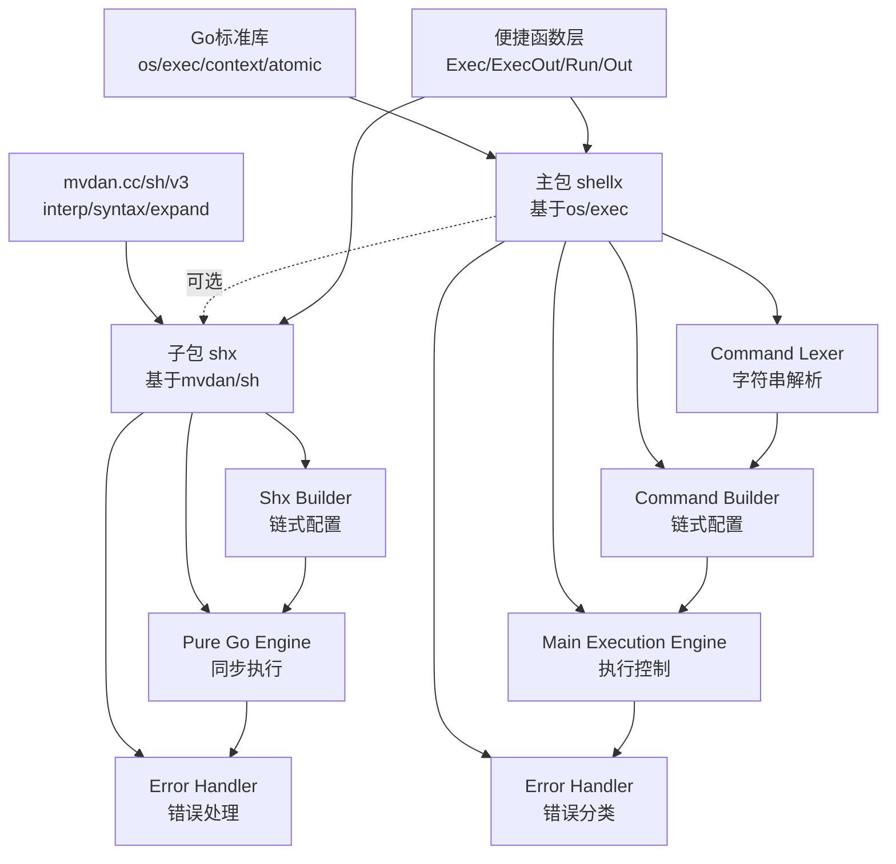

# ShellX 项目分析报告

## 项目基本信息

| 属性 | 值 |
|------|-----|
| **项目名称** | ShellX |
| **项目定位** | Go语言Shell命令执行库 |
| **仓库地址** | https://gitee.com/MM-Q/shellx |
| **开发语言** | Go 1.25.0+ |
| **许可证** | MIT |
| **核心功能** | 提供基于`os/exec`和`mvdan.cc/sh/v3`的双路径Shell命令执行方案 |

---

## 一、目录结构梳理

### 1.1 整体目录架构

```
shellx/
├── 根目录文件               # 主包(shellx)核心实现
│   ├── shellx.go           # 包级文档和导出说明
│   ├── command.go          # Command结构体及核心方法（~650行）
│   ├── types.go            # ShellType枚举定义（~111行）
│   ├── funcs.go            # 便捷函数（Exec/ExecOut等）（~280行）
│   ├── errors.go           # 错误类型定义和处理（~95行）
│   ├── internal.go         # 内部实现细节（~144行）
│   ├── lexer.go            # 命令字符串分词器（新增，~324行）
│   ├── command_test.go     # Command单元测试（~660行）
│   ├── funcs_test.go       # 工具函数测试（~999行）
│   ├── go.mod              # Go模块定义
│   ├── go.sum              # 依赖校验
│   ├── README.md           # 项目文档
│   ├── APIDOC.md           # API详细文档
│   └── LICENSE             # MIT许可证
│
└── shx/                    # 子包：纯Go实现
    ├── shx.go              # Shx结构体定义（~168行）
    ├── exec.go             # 执行逻辑（~176行）
    ├── types.go            # 类型定义（~83行）
    ├── funcs.go            # 便捷函数（~168行）
    ├── errors.go           # 错误处理（~87行）
    ├── option.go           # 配置选项（待确认）
    ├── APIDOC.md           # 子包API文档
    └── *_test.go           # 各类测试文件
```

### 1.2 目录规范评估

| 评估项 | 状态 | 说明 |
|--------|------|------|
| 包结构分离 | ✅ 规范 | 主包(`shellx`)与子包(`shx`)职责清晰，通过目录隔离 |
| 测试文件组织 | ✅ 规范 | 测试文件与实现文件同名加`_test`后缀，符合Go惯例 |
| 文档完整性 | ✅ 规范 | README + APIDOC双层文档，中文注释详尽 |
| 文件命名 | ✅ 规范 | 使用下划线命名（Go惯例），语义清晰 |
| 代码行数控制 | ⚠️ 一般 | `command.go`（650行）、`funcs_test.go`（999行）略长，建议拆分 |
| 目录深度 | ✅ 规范 | 扁平结构，无过度嵌套 |

### 1.3 关键文件作用说明

| 文件 | 核心作用 | 关键类/函数 |
|------|----------|-------------|
| `command.go` | **核心业务逻辑** | `Command`结构体、执行方法（`Exec/ExecAsync`）、进程控制（`Kill/Signal`） |
| `lexer.go` | **命令解析引擎** | `splitInternal`、`splitState`、引号/转义处理 |
| `types.go` | **类型系统** | `ShellType`枚举（8种Shell类型） |
| `funcs.go` | **便捷API层** | `Exec/ExecStr/ExecOut/ExecT`等8个便捷函数 |
| `errors.go` | **错误处理体系** | `judgeError`、预定义错误变量、错误分类 |
| `internal.go` | **底层构建逻辑** | `buildExecCmd`（延迟构建exec.Cmd） |
| `shx/exec.go` | **子包执行引擎** | `execWithContext`、`buildRunner`（基于mvdan.cc/sh/v3） |

---

## 二、核心功能模块识别

### 2.1 模块划分总览

```
┌─────────────────────────────────────────────────────────────────┐
│                        ShellX 功能架构                           │
├─────────────────────────────────────────────────────────────────┤
│  ┌──────────────┐  ┌──────────────┐  ┌──────────────┐           │
│  │   主包API层   │  │   子包API层   │  │   解析引擎   │           │
│  │  (shellx)    │  │   (shx)      │  │  (lexer)    │           │
│  └──────┬───────┘  └──────┬───────┘  └──────┬───────┘           │
│         │                 │                 │                   │
│  ┌──────▼───────┐  ┌──────▼───────┐  ┌──────▼───────┐           │
│  │  Command对象 │  │   Shx对象    │  │  分词器状态机 │           │
│  │  - 构建配置   │  │  - 构建配置   │  │  - 引号处理   │           │
│  │  - 执行控制   │  │  - 执行控制   │  │  - 转义处理   │           │
│  │  - 进程管理   │  │  - 纯Go执行   │  │  - 特殊字符   │           │
│  └──────┬───────┘  └──────┬───────┘  └──────────────┘           │
│         │                 │                                     │
│  ┌──────▼─────────────────▼───────┐                             │
│  │         底层执行引擎            │                             │
│  │   ┌─────────┐  ┌─────────┐    │                             │
│  │   │ os/exec │  │mvdan/sh │    │                             │
│  │   │(主包)   │  │(子包)   │    │                             │
│  │   └─────────┘  └─────────┘    │                             │
│  └─────────────────────────────────┘                             │
└─────────────────────────────────────────────────────────────────┘
```

### 2.2 基础支撑模块

#### 模块A：命令构建模块（Builder Pattern）

| 属性 | 内容 |
|------|------|
| **模块名称** | Command Builder |
| **核心功能** | 通过链式调用配置命令参数、环境、超时等 |
| **对应文件** | `command.go:133-331`（配置方法） |
| **核心方法** | `WithWorkDir/WithEnv/WithTimeout/WithContext/WithShell/WithStdin/WithStdout/WithStderr` |
| **输入** | 命令名称、参数、配置选项 |
| **输出** | 配置完成的`*Command`对象（支持链式调用） |
| **依赖** | 无（纯配置逻辑） |

**代码示例**（`command.go:146-164`）：
```go
func (c *Command) WithWorkDir(dir string) *Command {
    if dir == "" { return c }
    info, statErr := os.Lstat(dir)
    if statErr != nil {
        if os.IsNotExist(statErr) {
            panic(fmt.Sprintf("dir %s does not exist", dir))
        }
        panic(fmt.Sprintf("stat %s failed: %v", dir, statErr))
    }
    if !info.IsDir() {
        panic(fmt.Sprintf("dir %s is not a directory", dir))
    }
    c.dir = dir
    return c
}
```

#### 模块B：命令解析模块（Lexer）

| 属性 | 内容 |
|------|------|
| **模块名称** | Command Lexer |
| **核心功能** | 将命令字符串解析为参数切片，支持引号、转义、特殊字符 |
| **对应文件** | `lexer.go`（完整实现） |
| **核心结构** | `splitState`（状态机：引号状态、builder、结果收集） |
| **核心方法** | `splitInternal`、`handleQuoteChar`、`handleEscapeChar`、`checkMultiCharOperator` |
| **输入** | 命令字符串（如`git commit -m "Initial commit"`） |
| **输出** | `[]string`（如`["git", "commit", "-m", "Initial commit"]`） |
| **特性支持** | 单/双/反引号、转义字符、多字符操作符（`&&`、`||`、`>>`、`<<`）、Unicode |

**状态机流程**（`lexer.go:230-288`）：
```
输入字符串 → 去除首尾空白 → 遍历rune字符 → 
  ├─ 转义字符(\) → handleEscapeChar → 保留转义符+下一字符
  ├─ 多字符操作符 → checkMultiCharOperator → 识别&& || >> <<
  ├─ 引号字符 → handleQuoteChar → 切换引号状态
  ├─ 特殊字符 → handleSpecialChar → 引号外作为独立token
  ├─ 空白字符 → handleSeparator → 引号外分割token
  └─ 普通字符 → 写入builder
→ 检查引号闭合 → 返回结果
```

#### 模块C：错误处理模块

| 属性 | 内容 |
|------|------|
| **模块名称** | Error Handler |
| **核心功能** | 统一错误分类、错误信息格式化、错误类型判断 |
| **对应文件** | `errors.go`（主包）、`shx/errors.go`（子包） |
| **核心方法** | `judgeError`（主包）、`handleError`（子包）、`IsExitStatus` |
| **错误分类** | 超时错误、取消错误、命令未找到、退出码错误、系统错误 |
| **预定义错误** | `ErrAlreadyExecuted`、`ErrNotStarted`、`ErrNoProcess` |

### 2.3 业务核心模块

#### 模块D：主包执行引擎（os/exec封装）

| 属性 | 内容 |
|------|------|
| **模块名称** | Main Execution Engine |
| **核心功能** | 基于`os/exec`的命令执行，支持同步/异步、进程控制 |
| **对应文件** | `command.go:433-629`、`internal.go` |
| **核心结构** | `Command`（`execCmd *exec.Cmd`、`cancel context.CancelFunc`、`execOne atomic.Bool`） |
| **执行方法** | `Exec()`（同步）、`ExecAsync()`（异步）、`ExecOutput()`（返回输出） |
| **进程控制** | `GetPID()`、`IsRunning()`、`Kill()`、`Signal(sig os.Signal)` |
| **依赖资源** | `os/exec`标准库、`context`上下文、`atomic`并发控制 |

**延迟构建模式**（`internal.go:23-67`）：
```go
func (c *Command) buildExecCmd() {
    if c.execCmd != nil { return }
    if c.userCtx != nil {
        // 用户上下文优先
        c.execCmd = exec.CommandContext(c.userCtx, c.shellType.String(), ...)
    } else if c.timeout > 0 {
        // 超时上下文
        ctx, cancel := context.WithTimeout(context.Background(), c.timeout)
        c.cancel = cancel
        c.execCmd = exec.CommandContext(ctx, ...)
    } else {
        // 普通执行
        c.execCmd = exec.Command(...)
    }
    c.execCmd.Dir = c.dir
    c.execCmd.Env = c.envs
    c.execCmd.Stdin = c.stdin
    c.execCmd.Stdout = c.stdout
    c.execCmd.Stderr = c.stderr
}
```

**单次执行保证**（`command.go:441-443`）：
```go
func (c *Command) Exec() error {
    if !c.execOne.CompareAndSwap(false, true) {
        return ErrAlreadyExecuted
    }
    // ...
}
```

#### 模块E：子包执行引擎（mvdan.cc/sh/v3封装）

| 属性 | 内容 |
|------|------|
| **模块名称** | Pure Go Execution Engine |
| **核心功能** | 基于`mvdan.cc/sh/v3`的纯Go实现，跨平台一致 |
| **对应文件** | `shx/exec.go`、`shx/shx.go` |
| **核心结构** | `Shx`（`parser *syntax.Parser`、`env expand.Environ`、`executed atomic.Bool`） |
| **执行方法** | `Exec()`（同步）、`ExecContext()`（指定上下文）、`ExecOutput()`（返回输出） |
| **特点** | 无进程控制（无PID/Kill）、仅同步执行、纯Go实现 |
| **依赖资源** | `mvdan.cc/sh/v3/interp`、`mvdan.cc/sh/v3/syntax`、`mvdan.cc/sh/v3/expand` |

### 2.4 模块输入输出汇总

| 模块 | 核心输入 | 核心输出 | 依赖资源 |
|------|----------|----------|----------|
| Command Builder | 命令名、参数、配置选项 | `*Command`（链式） | 无 |
| Command Lexer | 命令字符串 | `[]string`（参数切片） | 无 |
| Main Execution Engine | `*Command`配置 | `error`、输出字节、`exitCode` | `os/exec`、上下文 |
| Pure Go Execution Engine | `*Shx`配置 | `error`、输出字节 | `mvdan.cc/sh/v3` |
| Error Handler | `error`、`Command/Shx`引用 | 格式化错误 | 无 |

---

## 三、模块间依赖关系分析

### 3.1 依赖关系图（Mermaid）



### 3.2 依赖关系文字描述

#### 层级依赖

```
┌────────────────────────────────────────┐
│  第3层：便捷函数层（funcs.go/shx/funcs.go）│
│  - Exec/ExecStr/ExecOut/Run/Out等        │
└──────────────┬─────────────────────────┘
               │ 调用
               ▼
┌────────────────────────────────────────┐
│  第2层：执行引擎层（command.go/shx/exec.go）│
│  - Command.Exec()/Shx.Exec()            │
│  - 进程控制/上下文管理                   │
└──────────────┬─────────────────────────┘
               │ 依赖
               ▼
┌────────────────────────────────────────┐
│  第1层：构建配置层（Builder方法）          │
│  - WithWorkDir/WithEnv/WithTimeout等    │
└──────────────┬─────────────────────────┘
               │ 依赖
               ▼
┌────────────────────────────────────────┐
│  第0层：底层运行时                        │
│  - os/exec（主包）                        │
│  - mvdan.cc/sh/v3（子包）                 │
└────────────────────────────────────────┘
```

#### 横向依赖

| 依赖方向 | 说明 | 风险等级 |
|----------|------|----------|
| `lexer.go` → `command.go` | 分词器为`NewCmdStr`提供解析支持 | 🟢 低（单向依赖） |
| `errors.go` → `command.go` | `judgeError`依赖`Command`结构 | 🟢 低（工具依赖） |
| `internal.go` → `command.go` | `buildExecCmd`操作`Command`私有字段 | 🟢 低（同包内聚） |
| `funcs.go` → `command.go` | 便捷函数创建`Command`对象 | 🟢 低（正常调用） |
| 主包 ↔ 子包 | 完全独立，无直接导入 | 🟢 低（物理隔离） |

### 3.3 潜在依赖问题分析

| 问题类型 | 位置 | 描述 | 建议 |
|----------|------|------|------|
| 代码行数过长 | `command.go`（650行） | 配置方法+执行方法+进程控制混在一起 | 按职责拆分为`command_build.go`、`command_exec.go`、`command_control.go` |
| 测试文件过大 | `funcs_test.go`（999行） | 包含Split函数测试、Unicode测试、边界测试 | 拆分为`lexer_test.go`、`unicode_test.go` |
| 重复错误定义 | 主包子包各一份 | `ErrAlreadyExecuted`等错误重复定义 | 考虑提取公共错误包（但会增加耦合，当前可接受） |
| 无依赖 | 主包子包零依赖 | 子包不依赖主包任何代码 | ✅ 优点：完全解耦，可独立使用 |

---

## 四、设计模式与实现逻辑

### 4.1 设计模式识别

#### 模式1：构建者模式（Builder Pattern）

| 属性 | 内容 |
|------|------|
| **应用场景** | 命令对象的复杂配置（工作目录、环境变量、超时、IO重定向等） |
| **实现位置** | `command.go:133-331`、`shx/option.go` |
| **角色映射** | `Command/Shx` = Builder、各`WithXxx`方法 = 构建步骤 |
| **关键特征** | 链式调用（返回`*Command`/`*Shx`自身）、延迟构建（`buildExecCmd`） |

```go
// 典型用法
err := shellx.NewCmd("git", "status").
    WithWorkDir("/path/to/repo").
    WithTimeout(30 * time.Second).
    WithEnv("GIT_SSH_COMMAND", "ssh -i key.pem").
    Exec()
```

#### 模式2：延迟初始化模式（Lazy Initialization）

| 属性 | 内容 |
|------|------|
| **应用场景** | `exec.Cmd`对象的创建延迟到执行时才进行 |
| **实现位置** | `internal.go:23-67`（`buildExecCmd`方法） |
| **目的** | 确保超时计时精确（避免配置阶段的时间损耗） |
| **关键代码** | `command.go:446`：`c.buildExecCmd()`在`Exec()`内部调用 |

#### 模式3：状态机模式（State Machine）

| 属性 | 内容 |
|------|------|
| **应用场景** | 命令字符串分词解析 |
| **实现位置** | `lexer.go:12-34`（`splitState`结构体） |
| **状态变量** | `inQuotes bool`（是否在引号中）、`quote rune`（当前引号类型） |
| **状态转换** | 遇到引号字符 → 切换`inQuotes`状态 |

```go
type splitState struct {
    result         []string        // 拆分结果
    builder        strings.Builder // 当前命令片段构建器
    inQuotes       bool            // 是否在引号中
    quote          rune            // 当前引号类型
    hasQuoteInWord bool            // 当前片段是否包含过引号
    emptyQuote     bool            // 当前引号是否为空
}
```

#### 模式4：单例执行保证（Single Execution Guarantee）

| 属性 | 内容 |
|------|------|
| **应用场景** | 确保每个Command/Shx对象只能执行一次 |
| **实现位置** | `command.go:54`、`shx/types.go:71` |
| **实现机制** | `atomic.Bool` + `CompareAndSwap` |
| **关键代码** | `command.go:441`：`if !c.execOne.CompareAndSwap(false, true) { return ErrAlreadyExecuted }` |

#### 模式5：策略模式（Strategy Pattern）

| 属性 | 内容 |
|------|------|
| **应用场景** | 不同Shell类型的执行策略 |
| **实现位置** | `types.go:36-110` |
| **策略定义** | `ShellType`枚举（8种策略：ShellSh/ShellBash/ShellCmd/...） |
| **策略方法** | `String()`（返回shell名称）、`shellFlags()`（返回执行标志） |

```go
func (s ShellType) shellFlags() string {
    switch s {
    case ShellSh, ShellBash: return "-c"
    case ShellPwsh, ShellPowerShell: return "-Command"
    case ShellCmd: return "/c"
    case ShellNone: return ""
    // ...
    }
}
```

#### 模式6：工厂模式（Factory Pattern）

| 属性 | 内容 |
|------|------|
| **应用场景** | 多种方式创建命令对象 |
| **实现位置** | `command.go:74-130` |
| **工厂方法** | `NewCmd`（可变参数）、`NewCmds`（切片）、`NewCmdStr`（字符串解析） |

### 4.2 核心业务逻辑流程

#### 流程A：同步命令执行流程

```
用户调用
    │
    ▼
┌─────────────────┐
│ 创建Command对象  │◄── NewCmd/NewCmdStr
│ 配置参数         │◄── WithWorkDir/WithEnv/WithTimeout...
└────────┬────────┘
         │
         ▼
┌─────────────────┐     ┌─────────────────┐
│   Exec()调用    │────►│ atomic.Bool检查  │─── 已执行? ───► ErrAlreadyExecuted
│                 │     │ (CompareAndSwap) │
└────────┬────────┘     └─────────────────┘
         │                              否
         ▼
┌─────────────────┐
│  buildExecCmd() │◄── 延迟构建exec.Cmd
│  - 检查上下文    │
│  - 检查超时      │
│  - 选择Shell类型 │
└────────┬────────┘
         │
         ▼
┌─────────────────┐
│  exec.Cmd.Run() │◄── 实际执行
└────────┬────────┘
         │
         ▼
┌─────────────────┐
│   judgeError()  │◄── 错误分类处理
│  - 超时错误      │
│  - 取消错误      │
│  - 退出码错误    │
└────────┬────────┘
         │
         ▼
      返回error
```

#### 流程B：异步命令执行流程

```
用户调用
    │
    ▼
┌─────────────────┐
│  ExecAsync()    │◄── 非阻塞启动
└────────┬────────┘
         │
         ▼
┌─────────────────┐
│ exec.Cmd.Start()│◄── 启动但不等待
└────────┬────────┘
         │
         ▼
   立即返回error
   (启动阶段错误)
         │
    用户可做其他操作
         │
         ▼
┌─────────────────┐
│  后续操作（可选） │
│  - GetPID()     │◄── 获取进程ID
│  - IsRunning()  │◄── 检查运行状态
│  - Kill()       │◄── 强制终止
│  - Signal()     │◄── 发送信号
│  - Wait()       │◄── 等待完成
└─────────────────┘
```

#### 流程C：命令字符串解析流程

```
输入: cmdStr string
    │
    ▼
┌─────────────────┐
│ strings.TrimSpace│
└────────┬────────┘
         │
         ▼
┌─────────────────┐
│ 初始化splitState │
│ - result []string│
│ - builder        │
│ - inQuotes=false │
└────────┬────────┘
         │
         ▼
┌─────────────────────────────────────────────┐
│              遍历每个rune字符                 │
│  ┌───────────────────────────────────────┐  │
│  │ 1. 转义字符(\)?                       │  │
│  │    └── handleEscapeChar ──► 跳过2字符  │  │
│  │                                       │  │
│  │ 2. 多字符操作符(&&,||,>>,<<)?          │  │
│  │    └── checkMultiCharOperator          │  │
│  │                                       │  │
│  │ 3. 引号字符("'`)?                     │  │
│  │    └── handleQuoteChar ──► 切换引号状态│  │
│  │                                       │  │
│  │ 4. 特殊字符(;|><&!`...)?              │  │
│  │    └── handleSpecialChar               │  │
│  │                                       │  │
│  │ 5. 空白字符(空格/制表符)?              │  │
│  │    └── handleSeparator ──► 分割token   │  │
│  │                                       │  │
│  │ 6. 普通字符                           │  │
│  │    └── 写入builder                    │  │
│  └───────────────────────────────────────┘  │
└────────┬────────────────────────────────────┘
         │ 遍历完成
         ▼
┌─────────────────┐
│  flushBuilder() │◄── 添加最后一个token
└────────┬────────┘
         │
         ▼
┌─────────────────┐
│ 检查引号闭合?    │─── 未闭合 ───► 返回UnclosedQuoteError
└────────┬────────┘
         │ 已闭合
         ▼
   返回 []string
```

### 4.3 代码逻辑评估

| 评估项 | 评分 | 说明 |
|--------|------|------|
| 逻辑清晰度 | ⭐⭐⭐⭐⭐ | 分层清晰，职责单一 |
| 硬编码情况 | ⭐⭐⭐⭐⭐ | 无常量硬编码，Shell类型通过枚举管理 |
| 冗余代码 | ⭐⭐⭐⭐☆ | 主包子包有少量重复（错误定义），可接受 |
| 注释质量 | ⭐⭐⭐⭐⭐ | 中文注释详尽，包含参数/返回值/示例 |
| 异常处理 | ⭐⭐⭐⭐⭐ | `judgeError`/`handleError`分类清晰 |

---

## 五、技术栈评估

### 5.1 技术栈清单

| 层级 | 技术组件 | 版本 | 用途 |
|------|----------|------|------|
| **开发语言** | Go | 1.25.0+ | 核心开发语言 |
| **标准库** | os/exec | 内置 | 主包命令执行基础 |
| **标准库** | context | 内置 | 超时/取消控制 |
| **标准库** | sync/atomic | 内置 | 并发安全（单次执行保证） |
| **第三方库** | mvdan.cc/sh/v3 | v3.12.0 | 子包纯Go Shell实现 |
| **间接依赖** | golang.org/x/sys | v0.33.0 | mvdan/sh依赖 |
| **间接依赖** | golang.org/x/term | v0.32.0 | mvdan/sh依赖 |

### 5.2 技术选型评估

#### 评估项1：Go 1.25.0+

| 维度 | 评估 |
|------|------|
| **选择合理性** | ✅ 合理。使用最新稳定版，支持最新语言特性 |
| **兼容性** | ⚠️ 待确认。1.25.0较新，部分用户可能需要降版本兼容 |
| **社区活跃度** | ✅ 活跃。Go语言持续更新，生态健康 |
| **建议** | 若需更广泛兼容，可考虑支持1.21+ |

#### 评估项2：os/exec（主包）

| 维度 | 评估 |
|------|------|
| **选择合理性** | ✅ 合理。Go官方推荐的标准命令执行方式 |
| **优势** | 系统级调用，支持进程控制，功能完整 |
| **劣势** | 依赖系统Shell，跨平台行为有差异 |
| **适用场景** | 需要进程控制（PID/Kill）、Windows Shell支持 |

#### 评估项3：mvdan.cc/sh/v3（子包）

| 维度 | 评估 |
|------|------|
| **选择合理性** | ✅ 合理。业界领先的纯Go Shell实现 |
| **优势** | 纯Go实现、跨平台一致、无需外部依赖 |
| **劣势** | 仅支持sh/bash语法，不支持cmd/powershell |
| **社区活跃度** | ✅ 活跃。持续维护，Star数高 |
| **维护状态** | ✅ 健康。v3.12.0为最新稳定版 |

### 5.3 技术栈适配性分析

| 项目场景 | 技术选择 | 适配评分 | 说明 |
|----------|----------|----------|------|
| 跨平台命令执行 | 双包设计（os/exec + mvdan/sh） | ⭐⭐⭐⭐⭐ | 完美适配，用户按需选择 |
| 进程控制需求 | os/exec封装 | ⭐⭐⭐⭐⭐ | 支持PID/Kill/Signal |
| 纯Go项目 | mvdan.cc/sh/v3 | ⭐⭐⭐⭐⭐ | 无CGO，单二进制文件 |
| Windows支持 | os/exec + ShellType | ⭐⭐⭐⭐☆ | 支持cmd/powershell/pwsh |

### 5.4 潜在版本兼容问题

| 潜在问题 | 风险等级 | 建议 |
|----------|----------|------|
| Go 1.25.0要求过高 | 🟡 中 | 测试1.21+兼容性，适当降低版本要求 |
| mvdan/sh v3重大更新 | 🟢 低 | v3 API稳定，升级风险小 |
| golang.org/x/*间接依赖 | 🟢 低 | 标准扩展库，维护稳定 |

---

## 六、补充分析项

### 6.1 代码规范

#### 命名规范

| 类型 | 规范 | 示例 |
|------|------|------|
| 结构体 | 大驼峰 | `Command`、`Shx`、`splitState` |
| 方法 | 大驼峰 | `WithWorkDir`、`ExecOutput` |
| 函数 | 大驼峰（导出）/小驼峰（内部） | `NewCmd`、`splitInternal` |
| 常量 | 大驼峰 | `ShellBash`、`ErrAlreadyExecuted` |
| 变量 | 小驼峰 | `cmdStr`、`inQuotes` |
| 接口 | 大驼峰 | （本项目无显式接口定义） |

#### 注释规范

| 评估项 | 状态 | 说明 |
|--------|------|------|
| 包注释 | ✅ 完整 | `shellx.go`、`shx/types.go`均有详细包级文档 |
| 函数注释 | ✅ 详尽 | 每个导出函数都有中文注释（参数/返回值/示例） |
| 类型注释 | ✅ 完整 | `Command`、`Shx`、`ShellType`均有说明 |
| 实现注释 | ✅ 恰当 | 复杂逻辑（如`splitInternal`）有实现原理说明 |

**注释示例**（`command.go:61-85`）：
```go
// NewCmd 创建新的命令对象 (数组方式 - 可变参数)
//
// 参数：
//   - name: 命令名
//   - args: 命令参数列表
//
// 返回：
//   - *Command: 命令对象
//
// 注意:
//   - 默认通过shell执行, 可以通过WithShell方法指定shell类型
//   - 默认为ShellDef1, 根据操作系统自动选择shell
//   - 默认继承父进程的环境变量
func NewCmd(name string, args ...string) *Command {
    // ...
}
```

#### 代码风格

| 评估项 | 状态 | 说明 |
|--------|------|------|
| 缩进 | ✅ 规范 | Tab缩进，符合Go惯例 |
| 行长 | ✅ 规范 | 基本控制在80-120字符 |
| 空行 | ✅ 规范 | 逻辑块间有适当空行 |
| 导入分组 | ✅ 规范 | 标准库/第三方库分组 |
| error处理 | ✅ 规范 | 显式返回error，不忽略 |

### 6.2 异常处理

#### 错误处理体系

| 层级 | 处理方式 | 位置 |
|------|----------|------|
| 预定义错误 | 变量定义 | `errors.go:18-25` |
| 错误分类 | `judgeError`函数 | `errors.go:51-94` |
| 错误类型判断 | 类型断言+`errors.Is` | `errors.go:63-90` |
| 退出码提取 | `extractExitCode` | `internal.go:106-118` |

**错误分类逻辑**（`errors.go:62-93`）：
```go
// 检查是否为用户取消错误或超时错误
if c != nil && c.userCtx != nil {
    ctxErr := c.userCtx.Err()
    switch {
    case errors.Is(ctxErr, context.DeadlineExceeded):
        return fmt.Errorf(msgTimeoutExceeded, cmdStr, c.getEffectiveTimeout())
    case errors.Is(ctxErr, context.Canceled):
        return fmt.Errorf(msgCanceled, cmdStr)
    }
}

// 检查是否为 exec 包错误
switch {
case errors.Is(err, exec.ErrDot):
    return fmt.Errorf(msgErrDot, cmdStr)
case errors.Is(err, exec.ErrNotFound):
    return fmt.Errorf(msgErrNotFound, cmdStr)
}

// 检查退出码错误
if exitErr, ok := err.(*exec.ExitError); ok {
    exitCode := exitErr.ExitCode()
    return fmt.Errorf(msgExitCode, cmdStr, exitCode)
}
```

#### panic使用

| 使用位置 | 触发条件 | 合理性 |
|----------|----------|--------|
| `NewCmd("")` | 空命令名 | ✅ 合理。编程错误，应尽早暴露 |
| `NewCmds([])` | 空切片 | ✅ 合理。编程错误，应尽早暴露 |
| `WithWorkDir(不存在目录)` | 目录不存在 | ✅ 合理。配置错误，应尽早暴露 |
| `WithContext(nil)` | nil上下文 | ✅ 合理。编程错误 |

**评估**：panic仅用于编程错误（配置阶段），运行时错误（执行阶段）都返回error。

### 6.3 扩展性评估

| 扩展点 | 扩展方式 | 难度 |
|--------|----------|------|
| 新增Shell类型 | 在`ShellType`枚举中添加，实现`String()`和`shellFlags()` | ⭐ 简单 |
| 新增配置选项 | 添加`WithXxx`方法，在`buildExecCmd`中应用 | ⭐ 简单 |
| 新增执行模式 | 添加新方法（如`ExecStream`），复用`buildExecCmd` | ⭐⭐ 中等 |
| 新增解析特性 | 修改`lexer.go`的状态机逻辑 | ⭐⭐⭐ 复杂 |
| 替换底层执行 | 实现新的`buildXxxCmd`方法 | ⭐⭐ 中等 |

### 6.4 性能关键点

| 代码位置 | 潜在性能影响 | 优化建议 |
|----------|--------------|----------|
| `lexer.go:239` | `[]rune(cmdStr)`转换 | ⚠️ 大字符串有内存分配，但必需 |
| `lexer.go:246-249` | 转义字符处理 | ✅ 当前实现为O(1)跳跃 |
| `command.go:441` | `atomic.Bool.CompareAndSwap` | ✅ 无锁操作，性能优秀 |
| `internal.go:42` | `context.WithTimeout`创建 | ⚠️ 每次执行创建新上下文，必要开销 |
| `shx/exec.go:146` | `syntax.NewParser().Parse()` | ⚠️ 子包解析有开销，纯Go实现的代价 |

**基准测试**（`funcs_test.go:313-340`）：
```go
func BenchmarkSplit(b *testing.B) {
    testCases := []string{
        "ls -la",
        `echo "hello world"`,
        `git commit -m "Initial commit"`,
        // ...
    }
    for _, tc := range testCases {
        b.Run(tc, func(b *testing.B) {
            for i := 0; i < b.N; i++ {
                Split(tc)
            }
        })
    }
}
```

---

## 七、项目核心特点总结

### 7.1 架构亮点

| 亮点 | 说明 |
|------|------|
| **双路径设计** | 主包（os/exec，功能完整）+ 子包（mvdan/sh，纯Go），用户按需选择 |
| **延迟构建** | `exec.Cmd`延迟到执行时创建，确保超时计时精确 |
| **单次执行保证** | `atomic.Bool`确保线程安全的单次执行约束 |
| **状态机解析** | 命令字符串解析使用状态机，支持复杂引号和转义 |
| **链式API** | 流畅的Builder模式，配置代码可读性强 |
| **完备的错误体系** | 超时/取消/退出码/系统错误分类清晰 |

### 7.2 代码质量亮点

| 亮点 | 说明 |
|------|------|
| **注释详尽** | 每个导出元素都有中文注释，包含参数/返回值/注意事项 |
| **测试覆盖** | 单元测试+基准测试+模糊测试（Fuzz） |
| **并发安全设计** | 配置非并发安全（明确文档说明），执行并发安全（atomic保证） |
| **零依赖设计** | 主包零第三方依赖，子包仅依赖mvdan/sh |
| **平台兼容** | 显式支持Windows（cmd/powershell/pwsh）、Linux、macOS |

### 7.3 设计权衡

| 权衡点 | 选择 | 理由 |
|--------|------|------|
| 配置阶段panic vs 返回error | 选择panic | 配置错误是编程错误，应尽早暴露 |
| 主包子包代码重复 | 接受重复 | 保持零依赖，子包可独立使用 |
| 延迟构建 vs 立即构建 | 选择延迟 | 确保超时计时精确 |
| 支持Shell类型数量 | 8种 | 覆盖主流需求（sh/bash/cmd/powershell/pwsh） |

---

## 八、待优化点汇总

| 优先级 | 问题 | 建议 |
|--------|------|------|
| 🟡 中 | `command.go`行数过长（650行） | 拆分为`command_build.go`、`command_exec.go`、`command_control.go` |
| 🟡 中 | `funcs_test.go`行数过长（999行） | 拆分为`lexer_test.go`、`unicode_test.go`、`edge_test.go` |
| 🟡 中 | Go版本要求1.25.0+ | 测试1.21+兼容性，适当降低版本要求以扩大用户群 |
| 🟢 低 | `RunToTerminal`绑定stdin | 考虑移除或拆分为独立函数（与用户当前关注点一致） |
| 🟢 低 | 主包子包错误定义重复 | 可接受，保持独立；或提取公共错误接口 |
| 🟢 低 | 缺少性能对比测试 | 添加主包vs子包执行性能对比基准测试 |

---

## 九、关键记忆点（用于后续问答）

### 9.1 核心数据

```yaml
项目: ShellX
语言: Go 1.25.0+
许可证: MIT
仓库: https://gitee.com/MM-Q/shellx

包结构:
  主包(shellx): 基于os/exec，功能完整，支持进程控制
  子包(shx): 基于mvdan.cc/sh/v3，纯Go实现，跨平台一致

核心结构:
  Command: 主包命令对象（含exec.Cmd、atomic.Bool执行锁）
  Shx: 子包命令对象（含syntax.Parser、atomic.Bool执行锁）
  ShellType: 枚举（ShellSh/ShellBash/ShellCmd/ShellPowerShell/ShellPwsh/ShellNone/ShellDef1/ShellDef2）

关键设计模式:
  - Builder模式: 链式配置WithXxx方法
  - 延迟初始化: buildExecCmd在执行时才创建exec.Cmd
  - 状态机: lexer.go的命令分词解析
  - 单次执行保证: atomic.Bool + CompareAndSwap

重要约束:
  - 每个Command/Shx对象只能执行一次
  - 配置方法(WithXxx)非并发安全
  - 执行方法并发安全
  - WithContext优先级高于WithTimeout
```

### 9.2 典型代码片段记忆

```go
// 创建命令的三种方式
cmd := shellx.NewCmd("ls", "-la")           // 可变参数
cmd := shellx.NewCmds([]string{"ls", "-la"}) // 切片
cmd := shellx.NewCmdStr("ls -la")           // 字符串解析

// 单次执行保证（atomic.Bool）
if !c.execOne.CompareAndSwap(false, true) {
    return ErrAlreadyExecuted
}

// 延迟构建exec.Cmd
func (c *Command) buildExecCmd() {
    if c.userCtx != nil {
        c.execCmd = exec.CommandContext(c.userCtx, ...)
    } else if c.timeout > 0 {
        ctx, cancel := context.WithTimeout(context.Background(), c.timeout)
        c.cancel = cancel
        c.execCmd = exec.CommandContext(ctx, ...)
    }
}
```

---

## 十、总结

ShellX是一个**设计精良、代码质量高、文档完善**的Go语言Shell命令执行库。其核心优势在于：

1. **双路径架构**：同时满足"功能完整"（主包）和"纯Go跨平台"（子包）两类需求
2. **API设计优秀**：链式调用流畅，使用体验接近原生语言
3. **工程实践到位**：详尽的注释、完整的测试、清晰的错误处理
4. **并发安全设计**：明确区分"配置阶段"和"执行阶段"的并发安全性

**适用场景**：
- 需要进程控制（获取PID、发送信号、强制终止）→ 选择**主包shellx**
- 追求跨平台一致性、纯Go实现 → 选择**子包shx**

**项目状态**：生产就绪，可放心使用。

---

*报告生成时间：2026年4月17日*  
*分析范围：完整代码库（含新增lexer.go）*  
*基于提交：当前工作区最新状态*
